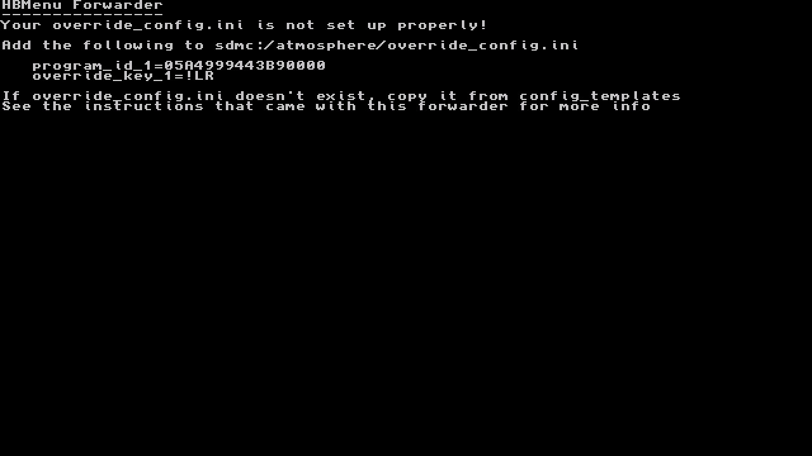

# HBMenu Forwarder

 This is a stub application, to make it launch hbmenu you have to configure Atmosphère to override 05A4999443B90000.

 To configure title override, copy `override_config.ini` from `sdmc:/atmosphere/config_templates` to
 `sdmc:/atmosphere/config`, then add the following lines under `[hbl_config]`

    program_id_1=05A4999443B90000
    override_key_1=!LR

 Automatic override is also possible with ReiNX by creating `sdmc:/ReiNX/config/override_config.ini`
 and adding `[hbl_config]` followed by the above, or by copying the file from Atmosphère.
 
 If you use SX OS, override configs are not possible. There is a version which does not require title override,
 but it will not get automatic feature or bugfix updates to hbl. Consider using Atmosphère :)
 
# Why title override?
 In short, using title override means Atmosphère knows you're running the homebrew menu, and you always get the latest
 version of hbloader (sdmc:/atmosphere/hbl.nsp) without having to update the forwarder

# Why not override a game like a normal person?
 I'm already banned and I want an hbmenu icon. Also if you use sys-clk it still applies clocks when you override games.

# Thanks
 [Root-MtX](https://github.com/Root-MtX/Nro2Nsp) for the Nro2Nsp tool which is easier than figuring out how
 to make an NSP myself  
 [LibNX Examples](https://github.com/switchbrew/switch-examples), which I used to make the stub screen with zero
 knowledge of the C language
 